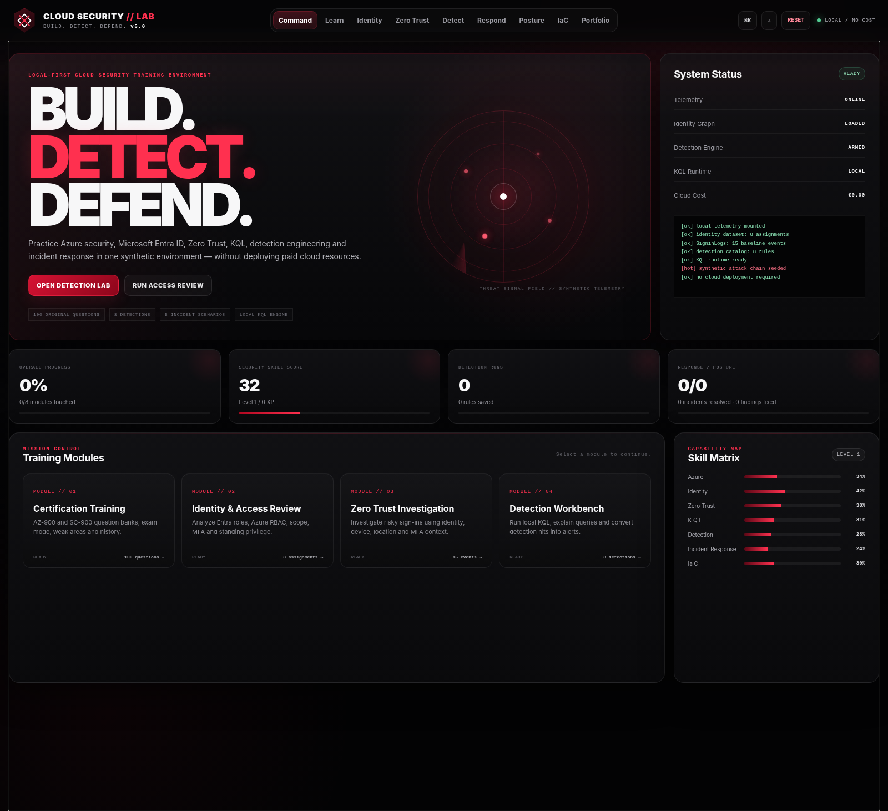
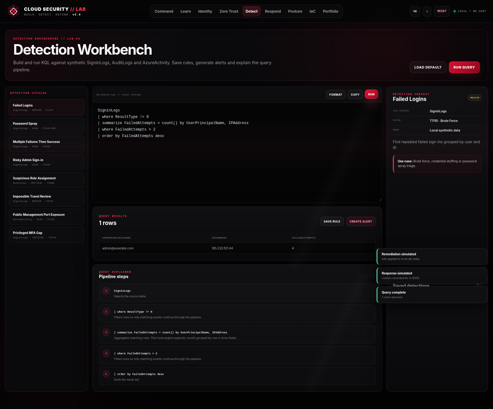
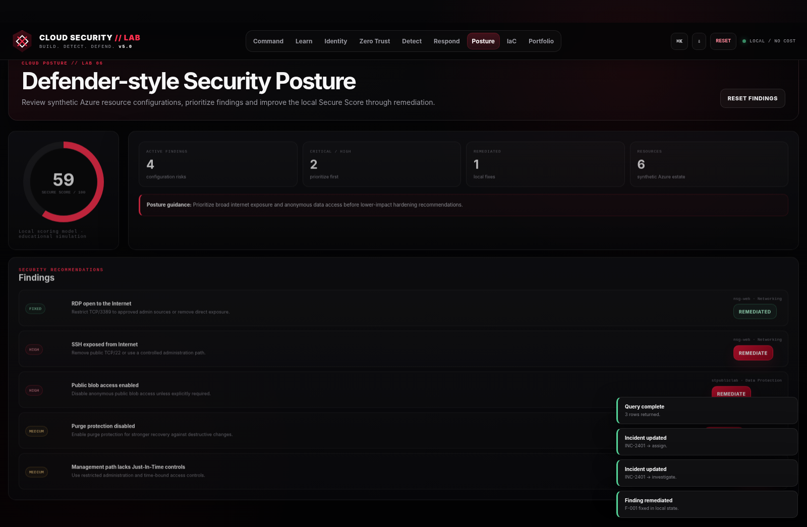
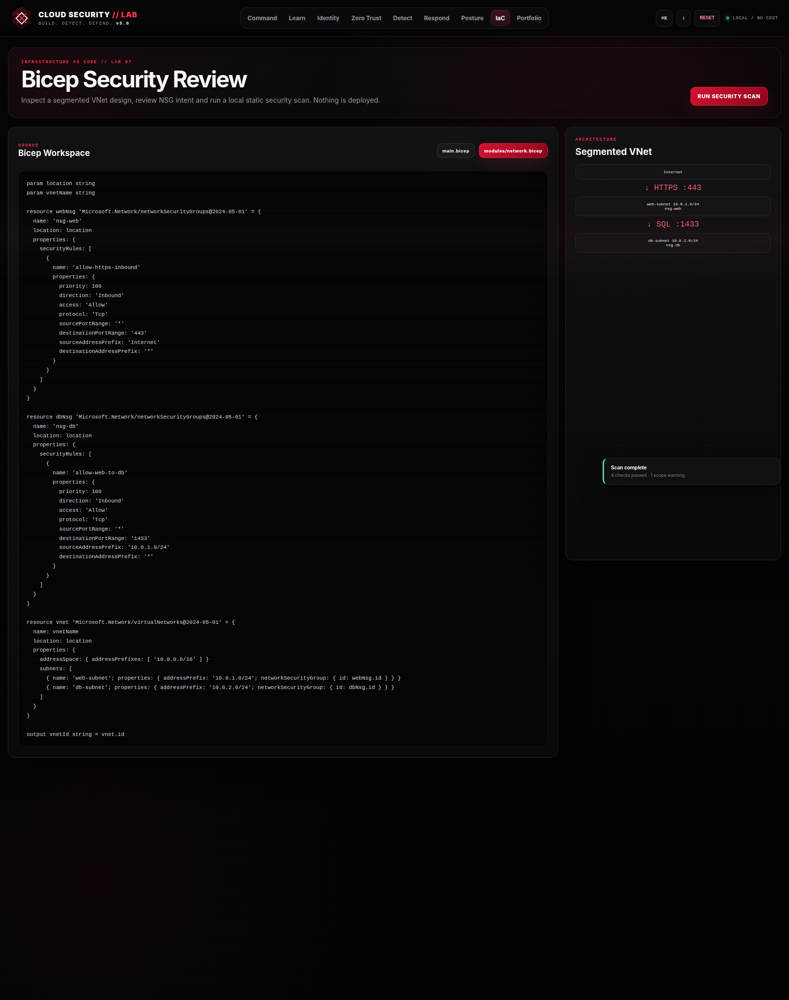

# Cloud Security Fundamentals Lab — v5.0

> **BUILD. DETECT. DEFEND.**
>
> A local-first, browser-based cloud security training environment for Azure and Microsoft Security concepts. No Azure subscription, tenant, VM, Sentinel workspace, or paid cloud resource is required.



## What v5.0 is

v5.0 turns the original fundamentals lab into a connected defensive-security environment instead of a collection of isolated exercises. Training, identity review, sign-in investigation, local KQL, detections, incidents, cloud posture, Bicep review and portfolio evidence now share one product and one local state.

The lab remains intentionally **synthetic and educational**. It is designed to practice the reasoning behind Azure / Microsoft security workflows without pretending to be Microsoft Sentinel, Defender for Cloud or a real Azure tenant.

## Highlights

- **100 original certification-practice questions** — 50 AZ-900 and 50 SC-900
- **Quiz modes** — Quick Practice, Study Session, Full Block and Exam Mode
- **Weak-area and session tracking** stored locally
- **Identity & Access Review** with Microsoft Entra roles and Azure RBAC kept technically distinct
- **Zero Trust Investigation** built around a correlated suspicious sign-in chain
- **Local KQL Workbench** over synthetic `SigninLogs`, `AuditLogs` and `AzureActivity`
- **8 detection templates** with learning-oriented MITRE ATT&CK context
- **Incident Response Center** with triage, evidence, containment and resolution workflow
- **Cloud Posture Simulator** with a dynamic local Secure Score and remediation actions
- **Bicep Security Review** for a segmented VNet / NSG architecture
- **Portfolio Casebook** that turns completed investigations into exportable evidence
- **XP, levels and achievements** to make repeated practice visible
- **Command palette** with `Ctrl + K`
- **Responsive black/red SOC interface**, motion, scanlines, radar and micro-interactions
- **No-cost / local-first architecture** with browser storage only

## v5.0 interface

### Command dashboard


The command view is the mission-control layer for the entire lab: training progress, system state, module access, skill matrix and synthetic telemetry status.

### Detection Workbench



The local workbench runs a deliberately limited educational KQL subset and explains the query pipeline step by step. Results can be saved as local detection rules or promoted into synthetic alerts.

### Cloud posture



The posture module models misconfiguration risk, remediation and Secure Score movement using synthetic Azure resources.

### Bicep security review



The IaC module reviews a local Bicep architecture without deploying anything. The example separates web and database subnets and applies narrowly scoped NSG intent.

## Core lab flow

```text
LEARN
  ↓
IDENTITY & ACCESS REVIEW
  ↓
ZERO TRUST INVESTIGATION
  ↓
DETECTION ENGINEERING / KQL
  ↓
INCIDENT RESPONSE
  ↓
CLOUD POSTURE
  ↓
BICEP SECURITY REVIEW
  ↓
PORTFOLIO CASEBOOK
```

The main synthetic attack chain deliberately crosses multiple data sources:

```text
SigninLogs
admin@example.com
multiple failures → successful sign-in without MFA
        ↓
AuditLogs
unexpected Global Administrator assignment
        ↓
AzureActivity
internet-facing SSH rule added to nsg-web
        ↓
Detection → Alert → Incident → Containment → Case Study
```

## Detection catalog

| Detection | Source | Learning context |
|---|---|---|
| Failed Logins | `SigninLogs` | Brute-force triage |
| Password Spray | `SigninLogs` | Distributed authentication failures |
| Multiple Failures Then Success | `SigninLogs` | Suspicious successful access after failures |
| Risky Admin Sign-in | `SigninLogs` | Privileged-account investigation |
| Suspicious Role Assignment | `AuditLogs` | Unexpected Entra role assignment |
| Impossible Travel Review | `SigninLogs` | Location / identity anomaly review |
| Public Management Port Exposure | `AzureActivity` | Risky control-plane networking change |
| Privileged MFA Gap | `SigninLogs` | Privileged authentication hardening |

See [`docs/DETECTION-CATALOG.md`](docs/DETECTION-CATALOG.md) for details.

## Identity dataset

The Identity & Access Review intentionally distinguishes:

- **Microsoft Entra directory roles** — e.g. Global Administrator, Security Reader
- **Azure RBAC roles** — e.g. Reader, Contributor, Owner

The seeded environment includes legitimate assignments and deliberately risky assignments so learners can reason about role system, scope, standing access, MFA, expected access and least privilege.

## Local KQL runtime

The local runtime supports the subset required by the bundled exercises:

- table selection
- `where`
- `project`
- `summarize Alias = count() by ...`
- `order by`
- `take`
- `has` and `has_any`
- simple comparisons
- flattened/no-op `mv-expand` for the synthetic audit model

It is **not a Kusto implementation** and should not be treated as a replacement for Log Analytics, Azure Data Explorer or Microsoft Sentinel.

## Start locally

### Windows

Double-click:

```text
START-LAB.bat
```

or open `index.html` directly in a browser.

No Python, Node.js, Azure CLI or Azure subscription is required to use the lab.

## Project structure

```text
Cloud-Security-Fundamentals-Lab-v5.0/
├── index.html
├── START-LAB.bat
├── assets/
│   ├── css/
│   ├── js/
│   └── screenshots/
├── data/
│   ├── detections/
│   ├── identity/
│   ├── logs/
│   └── questions/
├── detections/
│   └── *.kql
├── iac/
│   ├── main.bicep
│   └── modules/
├── case-studies/
├── docs/
├── CHANGELOG.md
├── RELEASE-NOTES-v5.0.md
└── QA-REPORT.md
```

## Data and persistence

All runtime state is stored locally in the browser where available. The lab uses synthetic data and does not connect to a real Azure tenant.

Local state includes items such as:

- quiz history and weak areas
- analyst notes
- investigation tasks
- simulated remediation actions
- saved detections
- incident status
- posture remediation
- XP / achievements
- generated casebook entries

The **Portfolio** module can export the current lab state and casebook.

## Responsible positioning

This project demonstrates hands-on **security reasoning and product engineering in a synthetic environment**. It should not be represented as production Azure administration or production SOC experience.

A precise portfolio description is available in [`docs/PORTFOLIO.md`](docs/PORTFOLIO.md).

## v1.0 → v5.0

The original v1.0 established the project foundation: certification practice, Identity & Access Review, Zero Trust Investigation, KQL detections and Bicep examples.

v5.0 connects those pieces into one end-to-end environment with detections, incidents, posture management, local KQL execution, remediation, progression and portfolio evidence.

See [`CHANGELOG.md`](CHANGELOG.md) for the full evolution.

## QA

The v5 release was checked for:

- JavaScript syntax
- duplicate DOM IDs
- all nine application views
- certification quiz flow
- identity review and remediation actions
- Zero Trust event investigation and containment
- detection selection and local query execution
- saved detections and synthetic alert creation
- incident actions
- posture remediation
- Bicep scan results
- portfolio / casebook rendering
- command palette and reset modal

See [`QA-REPORT.md`](QA-REPORT.md).

---

**Cloud Security Fundamentals Lab v5.0**  
`BUILD. DETECT. DEFEND.`  
Local-first. Synthetic. No cloud cost required.
