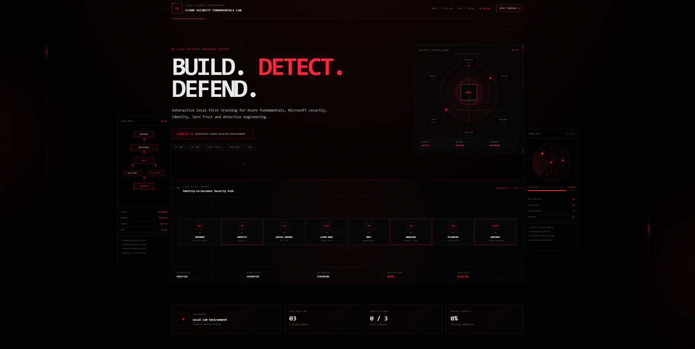
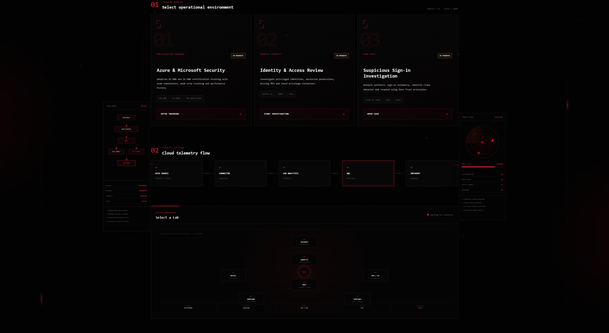
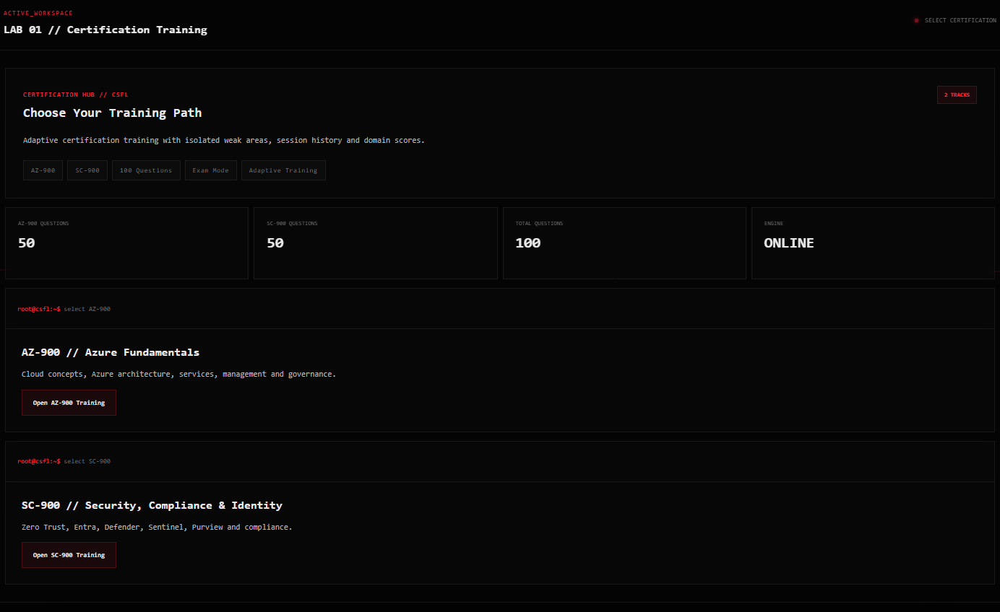
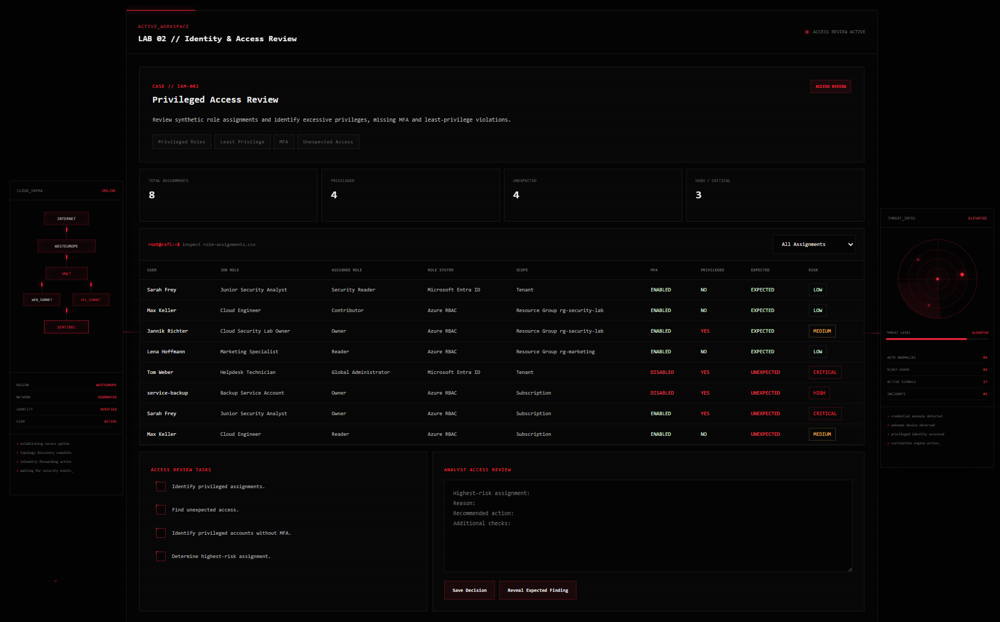
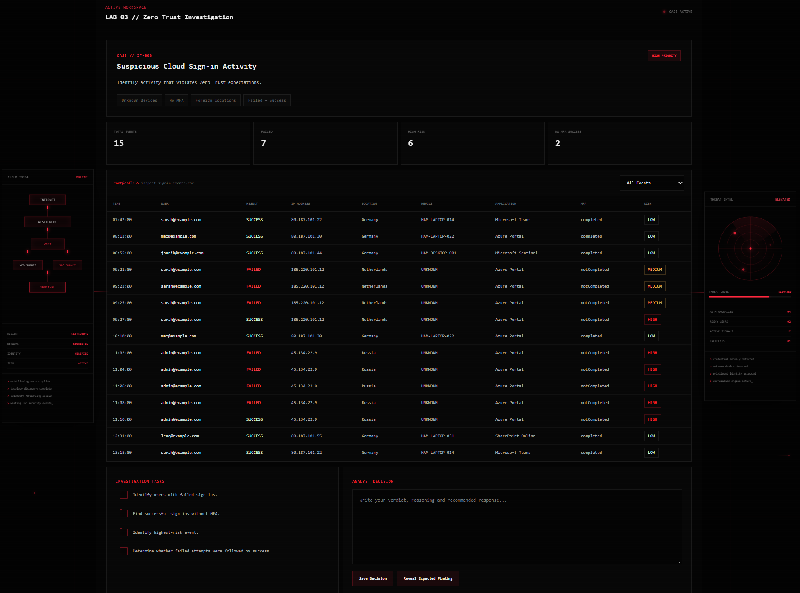

# Cloud Security Fundamentals Lab

> Local-first cloud security training environment for Azure fundamentals, Microsoft security concepts, identity security, Zero Trust, detection engineering, and certification practice.

Cloud Security Fundamentals Lab is an interactive browser-based learning and portfolio project designed to simulate cloud-security learning workflows without requiring a paid Azure subscription, Microsoft 365 tenant, virtual machines, or a Microsoft Sentinel workspace.

The project combines:

- AZ-900 and SC-900 certification training
- security investigations
- synthetic datasets
- KQL detection examples
- Bicep Infrastructure as Code
- local progress tracking
- exam simulations
- adaptive weak-area training
- a custom cloud-security / SOC interface

---

# Preview

## Cloud Security Dashboard



The main interface presents a synthetic cloud-security environment with:

- cloud attack-path visualization
- identity and network nodes
- threat-intelligence radar
- security telemetry
- interactive cloud architecture
- local lab progress

---

## Training Environment



The main training environment currently contains three operational modules:

1. Certification Training
2. Identity & Access Review
3. Zero Trust Investigation

---

## Certification Training



The certification engine currently supports:

- AZ-900
- SC-900
- 100 original practice questions
- Quick Practice
- Study Sessions
- Full Blocks
- Exam Mode
- Domain Practice
- Weak Areas
- Session History
- Domain Performance

---

## Identity & Access Review



The Identity Lab simulates a privileged-access investigation involving:

- Microsoft Entra ID roles
- Azure RBAC roles
- MFA coverage
- privileged identities
- excessive permissions
- least-privilege violations
- unexpected access

---

## Zero Trust Investigation



The Zero Trust Lab uses synthetic sign-in telemetry to investigate:

- failed authentication
- successful authentication without MFA
- unusual locations
- unknown devices
- high-risk sign-ins
- failed attempts followed by successful authentication

---

# Project Overview

The platform currently contains three primary training modules:

```text
01 // Certification Training
02 // Identity & Access Review
03 // Zero Trust Investigation
```

It also includes:

```text
100 certification questions
AZ-900 training
SC-900 training
Exam simulation
Weak-area tracking
Domain performance
Session history
Identity investigation
Zero Trust investigation
KQL detections
Bicep infrastructure examples
Local progress persistence
Responsive cloud-security interface
```

---

# 01 — Certification Training

The certification module provides interactive training for:

## AZ-900

Microsoft Azure Fundamentals.

Topics include:

- cloud computing
- public cloud
- private cloud
- hybrid cloud
- Shared Responsibility Model
- IaaS
- PaaS
- SaaS
- consumption-based pricing
- scalability
- elasticity
- high availability
- reliability
- serverless computing
- Azure regions
- Availability Zones
- Management Groups
- subscriptions
- Resource Groups
- Azure resources
- Virtual Machines
- Virtual Machine Scale Sets
- containers
- Azure Functions
- Azure App Service
- Virtual Networks
- subnets
- VNet Peering
- VPN Gateway
- ExpressRoute
- Private Endpoints
- Azure Storage
- storage redundancy
- Microsoft Entra ID
- MFA
- Conditional Access
- Azure RBAC
- Cost Management
- Azure Policy
- Resource Locks
- Azure Resource Manager
- Azure Arc
- Infrastructure as Code
- Azure Advisor
- Azure Service Health
- Azure Monitor
- Log Analytics

---

## SC-900

Microsoft Security, Compliance, and Identity Fundamentals.

Topics include:

- security concepts
- compliance concepts
- identity concepts
- Shared Responsibility
- Defense in Depth
- Zero Trust
- authentication
- authorization
- federation
- Microsoft Entra ID
- workload identities
- hybrid identity
- Multifactor Authentication
- passwordless authentication
- Conditional Access
- Least Privilege
- Identity Governance
- Access Reviews
- Privileged Identity Management
- Azure DDoS Protection
- Azure Firewall
- Web Application Firewall
- Network Security Groups
- Azure Bastion
- Azure Key Vault
- Microsoft Defender for Cloud
- Cloud Security Posture Management
- Cloud Workload Protection
- Microsoft Sentinel
- SIEM
- SOAR
- Microsoft Defender XDR
- Defender for Endpoint
- Defender for Identity
- Defender for Office 365
- Defender for Cloud Apps
- Vulnerability Management
- Threat Intelligence
- Microsoft Purview
- Compliance Manager
- Sensitivity Labels
- Data Loss Prevention
- Retention
- Records Management
- Insider Risk Management
- eDiscovery
- Audit

---

# Certification Question Banks

The project currently contains:

| Certification | Questions |
|---|---:|
| AZ-900 | 50 |
| SC-900 | 50 |
| **Total** | **100** |

All questions are original learning questions created for this project.

They are not official exam questions and are not copied certification dumps.

---

# Training Modes

Both certifications use the same reusable JavaScript training engine.

AZ-900 and SC-900 maintain independent:

- answers
- weak areas
- training history
- domain performance
- last training mode

---

## Quick Practice

Randomized set of 10 questions.

Designed for short review sessions.

---

## Study Session

Randomized set of 20 questions.

Designed for longer focused study sessions.

---

## Full Block

A complete 50-question training session.

---

## Exam Mode

Exam Mode creates a randomized 50-question simulation.

During the exam:

- answers are not immediately evaluated
- explanations remain hidden
- the result is displayed only after submission

After submission the user receives:

- total score
- correct answers
- incorrect answers
- pass/fail result
- domain breakdown
- complete answer review
- explanations

The project currently uses an 80% local training threshold.

This threshold is part of the project and does not represent Microsoft's official exam scoring formula.

---

## Domain Practice

Users can practice one certification domain at a time.

This makes it possible to focus on specific areas instead of repeatedly training the entire question bank.

---

## Weak Areas

Incorrect answers are automatically added to a certification-specific weak-area list.

Users can later launch a session containing only questions they previously answered incorrectly.

Correct answers remove the corresponding question from the weak-area list.

---

## Session History

Completed sessions are stored locally.

History entries include:

```text
Date
Certification
Training Mode
Score
Correct Answers
Total Questions
Passed / Failed
```

AZ-900 and SC-900 history is stored separately.

---

## Domain Performance

Historical results are aggregated by certification domain.

Example:

```text
Cloud Concepts                    84%
Azure Architecture and Services  76%
Management and Governance        91%
```

This allows weak topic areas to become visible over time.

---

# 02 — Identity & Access Review

The Identity & Access Review lab simulates a privileged-access investigation.

The analyst reviews synthetic role assignments and identifies:

- privileged identities
- excessive permissions
- unexpected role assignments
- missing MFA
- least-privilege violations
- permanent privileged access
- high-risk access

---

# Microsoft Entra Roles vs Azure RBAC

The lab explicitly distinguishes between two permission systems.

## Microsoft Entra ID Directory Roles

Examples:

```text
Global Administrator
Security Reader
```

These roles operate in Microsoft Entra ID.

---

## Azure RBAC Roles

Examples:

```text
Owner
Contributor
Reader
```

These roles control access to Azure resources.

The synthetic dataset therefore uses:

```text
AssignedRole
RoleSystem
Scope
```

instead of combining all role types into a single ambiguous category.

---

# Example Identity Findings

A low-risk expected assignment:

```text
Sarah Frey
Junior Security Analyst
Security Reader
Microsoft Entra ID
Tenant
MFA Enabled
Expected Access
LOW
```

A critical identity-security finding:

```text
Tom Weber
Helpdesk Technician
Global Administrator
Microsoft Entra ID
Tenant
MFA Disabled
Unexpected Access
CRITICAL
```

A high-risk Azure RBAC finding:

```text
service-backup
Backup Service Account
Owner
Azure RBAC
Subscription
MFA Disabled
Unexpected Access
HIGH
```

---

# Identity Investigation Tasks

The analyst must:

- identify privileged assignments
- find unexpected access
- identify privileged identities without MFA
- determine the highest-risk assignment

The application also allows the analyst to:

- filter role assignments
- write an access-review decision
- save the decision locally
- reveal the expected finding

---

# 03 — Zero Trust Investigation

The Zero Trust lab simulates suspicious cloud authentication activity.

The dataset contains synthetic Microsoft Entra-style sign-in events.

The analyst investigates:

- failed sign-ins
- successful sign-ins
- MFA state
- unknown devices
- unusual geographic locations
- suspicious IP addresses
- high-risk authentication events
- failed attempts followed by successful authentication

---

# Example Zero Trust Scenario

A privileged identity receives repeated failed authentication attempts from an unfamiliar location.

The failures are followed by:

```text
Successful Azure Portal authentication
Unknown device
MFA not completed
High-risk classification
```

The analyst must determine whether the event should be treated as suspicious and recommend a response.

---

# Zero Trust Investigation Tasks

The analyst must:

- identify users with failed sign-ins
- identify successful sign-ins without MFA
- identify the highest-risk event
- locate unknown devices
- determine whether failed attempts were followed by success

The analyst can also:

- filter sign-in telemetry
- complete investigation tasks
- write a security decision
- save the decision locally
- reveal the expected finding

---

# Zero Trust Concepts

The investigation reinforces three core concepts.

## Verify Explicitly

Access should be evaluated using signals such as:

```text
Identity
Authentication
Location
Device
Application
Risk
MFA state
```

---

## Use Least Privilege

Users and workloads should receive only the permissions required for their responsibilities.

---

## Assume Breach

Security architecture should assume compromise is possible and therefore emphasize:

```text
Segmentation
Monitoring
Detection
Investigation
Containment
Response
```

---

# Detection Engineering

The repository contains example KQL detections:

```text
detections/
├── failed-logins.kql
├── suspicious-role-assignment.kql
└── risky-admin-signin.kql
```

---

## Failed Login Detection

Demonstrates analysis of repeated failed authentication attempts.

Concepts include:

- `SigninLogs`
- time filtering
- grouping
- counting
- thresholds
- user analysis
- IP analysis

---

## Suspicious Role Assignment Detection

Demonstrates investigation of privileged-access changes.

Concepts include:

- `AuditLogs`
- RoleManagement
- `InitiatedBy`
- role assignments
- privileged access
- suspicious administrative changes

---

## Risky Admin Sign-in Detection

Demonstrates a simple administrator-name heuristic.

Example:

```kql
SigninLogs
| where TimeGenerated > ago(...)
| where ResultType == 0
| where UserPrincipalName has_any ("admin", "adm", "breakglass")
```

The username matching is intentionally a heuristic.

It does not verify actual privileged-role membership.

---

# Microsoft Sentinel Learning Flow

The project visualizes the conceptual security pipeline:

```text
Data Source
    │
    ▼
Data Connector
    │
    ▼
Log Analytics
    │
    ▼
KQL
    │
    ▼
Analytics Rule
    │
    ▼
Alert
    │
    ▼
Incident
    │
    ▼
Investigation
    │
    ▼
Response
```

This is a conceptual learning workflow.

The project is not connected to a live Microsoft Sentinel workspace.

---

# Infrastructure as Code

The repository contains a local Bicep example:

```text
infra/
└── network-security-lab.bicep
```

The template demonstrates concepts including:

- Azure Virtual Network
- subnet segmentation
- Network Security Groups
- workload separation
- Infrastructure as Code
- version-controlled infrastructure

The template exists for learning and portfolio demonstration.

It is not automatically deployed to Azure.

---

# Cloud Security Architecture

The interface visualizes a conceptual cloud-security path:

```text
Internet
   │
   ▼
Identity
   │
   ▼
Conditional Access / MFA
   │
   ▼
Cloud Edge
   │
   ▼
Virtual Network
   │
   ▼
Workload
   │
   ▼
Telemetry
   │
   ▼
Log Analytics
   │
   ▼
KQL Detection
   │
   ▼
Microsoft Sentinel
   │
   ▼
Incident Response
```

The goal is to connect individual cloud concepts to a complete security workflow.

---

# Interface Design

The project includes a custom cloud-security interface inspired by:

- Security Operations Centers
- threat-intelligence platforms
- cloud-security consoles
- terminal interfaces
- network topology systems
- detection engineering tools

The visual identity uses a black / red security theme.

---

# Interface Features

The interface contains:

```text
Animated cloud topology
Threat radar
Cloud attack-path visualization
Security telemetry
Animated data flows
Identity nodes
VNet nodes
Workload nodes
Sentinel nodes
Cloud-security pipeline
Responsive layouts
Terminal-style output
Synthetic system telemetry
```

---

# Microinteractions

Interactive visual features include:

- red hover glow
- cursor-following panel illumination
- magnetic buttons
- animated button scans
- card elevation
- targeting crosshair
- cursor particles
- dynamic telemetry pulses
- hero parallax
- controlled glitch effects
- animated cloud packets
- interactive cloud-fabric paths
- custom security checkboxes

---

# Synthetic Interface Telemetry

Some visual telemetry shown in the interface is intentionally synthetic.

Examples include:

```text
Packet counts
Threat levels
Incident counts
Signal counts
Region labels
Authentication state
Network state
Threat radar signals
SIEM state
```

These values exist for educational visualization.

They do not represent live Azure telemetry.

---

# Local-First Architecture

Cloud Security Fundamentals Lab is intentionally designed to work without paid cloud infrastructure.

It does **not** require:

- Azure Pay-As-You-Go
- Azure virtual machines
- Microsoft Sentinel workspace
- Microsoft 365 tenant
- paid Microsoft security licenses
- cloud deployment

The project runs locally in the browser.

---

# Local Progress Storage

Training progress is stored using browser `localStorage`.

Stored information includes:

- lab progress
- AZ-900 answers
- AZ-900 weak areas
- AZ-900 session history
- SC-900 answers
- SC-900 weak areas
- SC-900 session history
- Identity Lab analyst decision
- Zero Trust analyst decision

No backend is required.

---

# Reset Progress

The interface includes:

```text
RESET PROGRESS
```

Resetting removes local:

- certification answers
- weak areas
- session history
- lab progress
- analyst decisions

A confirmation dialog appears before the data is removed.

No training data is sent to a server by this project.

---

# Technology Stack

## Frontend

```text
HTML
CSS
JavaScript
```

## Data

```text
JSON
CSV
Markdown
```

## Cloud / Security

```text
KQL
Bicep
Microsoft Azure concepts
Microsoft Entra concepts
Microsoft Sentinel concepts
Microsoft Defender concepts
Microsoft Purview concepts
Zero Trust
```

## Development

```text
Visual Studio Code
PowerShell
Git
Live Server
```

---

# Project Structure

```text
Cloud-Security-Fundamentals-Lab/
│
├── index.html
│
├── style.css
├── scale.css
├── controls.css
├── effects.css
├── ambient.css
├── final-polish.css
│
├── app.js
├── controls.js
├── effects.js
├── ambient.js
├── final-polish.js
│
├── assets/
│   └── screenshots/
│       ├── 01-dashboard.png
│       ├── 01b-dashboard-labs.png
│       ├── 02-certification-training.png
│       ├── 03-identity-access-review.png
│       └── 04-zero-trust-investigation.png
│
├── data/
│   └── questions/
│       ├── az900.json
│       └── sc900.json
│
├── labs/
│   │
│   ├── 01-cloud-basics/
│   │   └── README.md
│   │
│   ├── 02-identity-and-access/
│   │   ├── README.md
│   │   ├── identity-model.json
│   │   ├── role-assignments.csv
│   │   ├── tasks.md
│   │   └── solution.md
│   │
│   └── 03-zero-trust/
│       ├── README.md
│       ├── scenario.md
│       ├── tasks.md
│       ├── solution.md
│       │
│       └── data/
│           └── signin-events.csv
│
├── detections/
│   ├── failed-logins.kql
│   ├── suspicious-role-assignment.kql
│   └── risky-admin-signin.kql
│
├── infra/
│   └── network-security-lab.bicep
│
├── notes/
│   └── sc900-az900-concepts.md
│
├── .gitignore
└── README.md
```

---

# Running the Project

Clone the repository:

```bash
git clone <repository-url>
```

Move into the project directory:

```bash
cd Cloud-Security-Fundamentals-Lab
```

Open the project in Visual Studio Code:

```bash
code .
```

The recommended way to run the project is with the VS Code Live Server extension.

Open:

```text
index.html
```

and select:

```text
Open with Live Server
```

The project loads JSON and CSV files using browser `fetch()`.

Opening `index.html` directly through a `file://` URL may therefore prevent some resources from loading due to browser security restrictions.

---

# No Azure Deployment Required

The current project does not deploy cloud resources.

The learning environment is designed to remain:

```text
LOCAL
NO-COST
REPEATABLE
SAFE TO EXPERIMENT WITH
```

Bicep infrastructure can be reviewed and validated locally without deploying it.

---

# Learning Goals

The project was built around several learning goals.

## Cloud Fundamentals

Understand:

- cloud computing
- Azure architecture
- Azure services
- cloud networking
- cloud governance

---

## Identity Security

Understand:

- authentication
- authorization
- Microsoft Entra ID
- Azure RBAC
- directory roles
- MFA
- Conditional Access
- privileged identities
- Least Privilege

---

## Security Operations

Understand:

- telemetry
- SIEM
- SOAR
- KQL
- detections
- alerts
- incidents
- investigations

---

## Zero Trust

Practice:

- explicit verification
- identity analysis
- device trust
- MFA analysis
- risk evaluation
- Least Privilege
- Assume Breach

---

## Infrastructure as Code

Practice:

- Bicep
- Azure architecture
- VNet design
- subnet segmentation
- NSG concepts
- version-controlled infrastructure

---

# Portfolio Skills Demonstrated

The repository is designed to demonstrate skills across several areas.

## Cloud Security

- Azure fundamentals
- Microsoft Entra
- Azure RBAC
- Zero Trust
- cloud networking
- security monitoring

## Detection Engineering

- KQL
- authentication analysis
- privileged-role monitoring
- suspicious activity detection

## Security Analysis

- identity review
- sign-in investigation
- risk classification
- analyst decision making

## Software Engineering

- HTML
- CSS
- JavaScript
- JSON
- CSV parsing
- localStorage
- frontend state
- reusable training logic
- responsive design
- modular JavaScript scopes

## Infrastructure as Code

- Bicep
- Git
- version-controlled infrastructure

---

# Current Project Status

```text
CLOUD SECURITY FUNDAMENTALS LAB // V1

Certification Engine          COMPLETE
AZ-900 Question Bank          50 Questions
SC-900 Question Bank          50 Questions
Total Question Bank           100 Questions

Quick Practice                COMPLETE
Study Session                 COMPLETE
Full Block                    COMPLETE
Exam Simulation               COMPLETE
Domain Practice               COMPLETE
Weak Area Tracking            COMPLETE
Session History               COMPLETE
Domain Performance            COMPLETE

Identity Access Lab           COMPLETE
Entra / RBAC Separation       COMPLETE

Zero Trust Lab                COMPLETE

KQL Detections                INCLUDED
Bicep Infrastructure          INCLUDED

Local Progress                COMPLETE
Reset System                  COMPLETE

Desktop Interface             COMPLETE
Responsive Interface          COMPLETE
Mobile Layout                 COMPLETE

Cloud Security Design         COMPLETE
Interactive Effects           COMPLETE
```

---

# Possible Future Extensions

Future versions could include:

- SC-200 training
- AZ-500 training
- additional certification questions
- KQL threat-hunting challenges
- Sentinel-style investigation timelines
- SOC cases
- Defender XDR investigations
- Infrastructure-as-Code security reviews
- attack-path analysis
- MITRE ATT&CK mapping
- detection-rule scoring
- larger synthetic datasets
- user-created question banks
- exportable training results

---

# Disclaimer

This repository is a personal educational and portfolio project.

It is not affiliated with, endorsed by, or sponsored by Microsoft.

Microsoft Azure, Microsoft Entra, Microsoft Sentinel, Microsoft Defender, Microsoft Purview, Microsoft 365, and related product names are trademarks of their respective owners.

Certification practice questions contained in this repository are original learning questions created for this project and are not official Microsoft exam questions.

All identities, security events, authentication logs, IP addresses, telemetry, threat indicators, risk values, incidents, and investigation scenarios used by the project are synthetic and intended for educational purposes.